# 🌟 삼성 청년 SW 아카데미 11기 SDC 1팀 **픔행제로** 🌟

# 🌳 프로젝트 개요

## ✨ 팀원

|  팀장  |  팀원  |  팀원  |  팀원  |  팀원  |  팀원  |
| :----: | :----: | :----: | :----: | :----: | :----: |
| 정현수 | 김경대 | 김가람 | 박수진 | 장재훈 | 김범수 |
|   FE   |   FE   |   BE   |   BE   |   AI   |   AI   |

## 📅 기간

- 기획 및 설계 : 2024.08.19 - 2024.08.23
- 개발 : 2024.08.26 - 2024.10.10

 

# 💎 소개

### 🌃 기획 의도

> **실제 검증에 쓰이는 AI** 에 학습시킬 양질의 불량 이미지를 만들어 **성능 및 정확도** 를 높이기!

4차 산업에 들어오면서 제조업은 최근 물건은 제조하는 양이 많아짐에 따라 불량 점검은 갈수록 어려워지고 있습니다.

따라서 AI를 활용한 불량을 점검하고 있는 추세인데, 해당 AI에 대한 도입 실패 확률이 높습니다.

여러 이유들 중 한 이유는  **양질의 데이터 부족**  입니다.

정상 데이터를 이용한 AI 학습은 편향적인 학습으로 인해 불량을 검증하는데 한계가 있습니다.

따라서 다량의 불량 이미지 DataSet이 필요하지만, 실제 제조 과정에서 발행하는 불량품의 생성량은 매우 작으며, 일부러 제품에 찍힘 및 스크래치 등을 만들어서 실제 불량 이미지를 만들어 내고 있지만, 한계가 있습니다.

따라서 저희 팀은 **제조 불량 이미지를 생성하는 Gen AI 시스템** 을 개발하여 이를 개선시키고자 합니다.

### 🌃 타겟층

**AI를 통해 불량을 판별하는 모든 기업 및 부서**

### 🔍 주요 기능

- **Stable Diffusion**을 이용한 결함 이미지 생성 및 이미지 수정

  - text-to-image, image-to-image, remove-background, inpainting, cleanup

- **학습**을 통해 특정 제품에 대한 결함, 정상 이미지 학습

- 이전 생성한 이미지에 대한 **History 기록**

- **Token 관리 및 통계** 제공

# 🔨 Tech Stack 🔨

### Front End

### Back End

### AI

### DB

### Infra

### Team Collaboration Tools

### Architecture

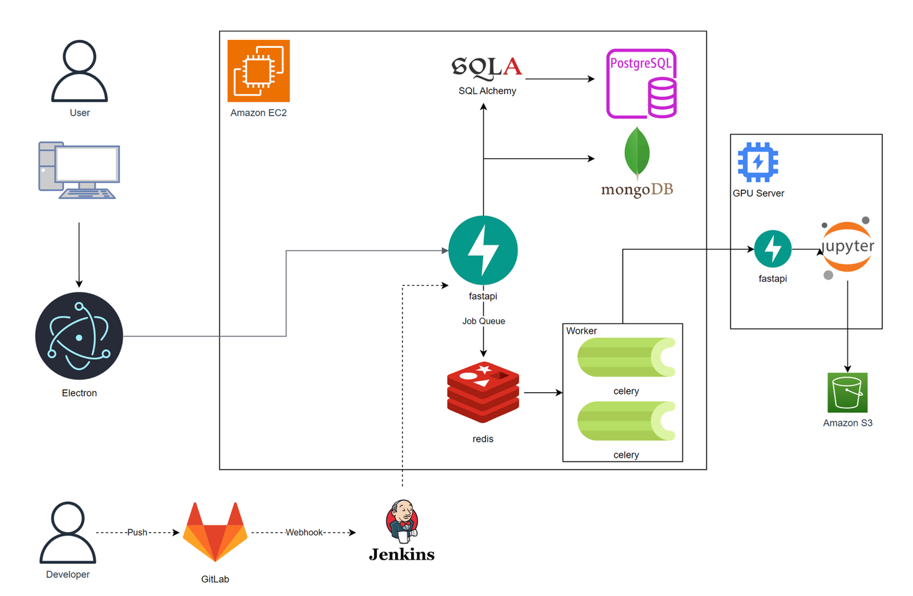

 

---

 

# 🌍 서비스 기능

## 🎯 Generation

### 📌 Text To Image

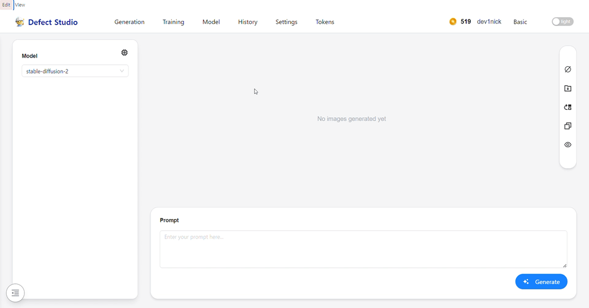

Text Prompt를 통해서 원하는 이미지를 생성할 수 있습니다.  
이를 통해서 다양한 불량 이미지를 생성할 수 있습니다.

Basic 모드에서는 Text 입력을 통해 간단하게 입력을 할 수 있고  
Advance 모드에서는 세부적인 Parameter들을 입력할 수 있습니다.

### 📌 Image To Image

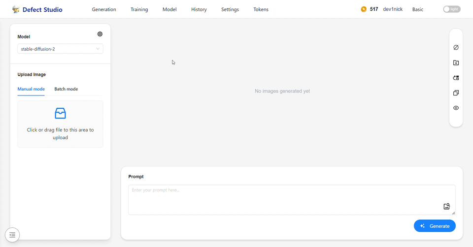

기존에 생성한 이미지를 업로드. 혹은 다른 파트에서 생성한 이미지를  
바로 가져와서 해당 이미지 바탕으로 또다른 이미지를 생성할 수 있습니다!

### 📌 Inpainting

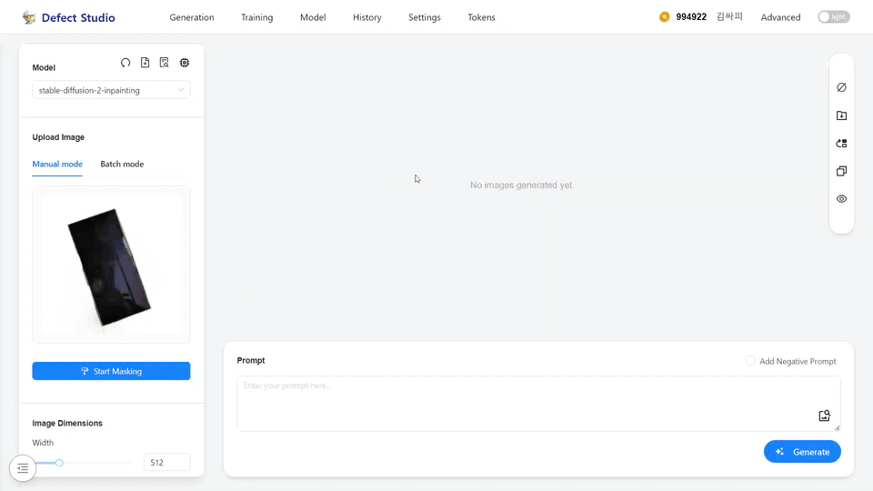

특정 영역을 선택해서, 이에 관한 프롬프트를 입력하여 원하는 이미지를 생성 할 수 있습니다.

### 📌 Clean Up

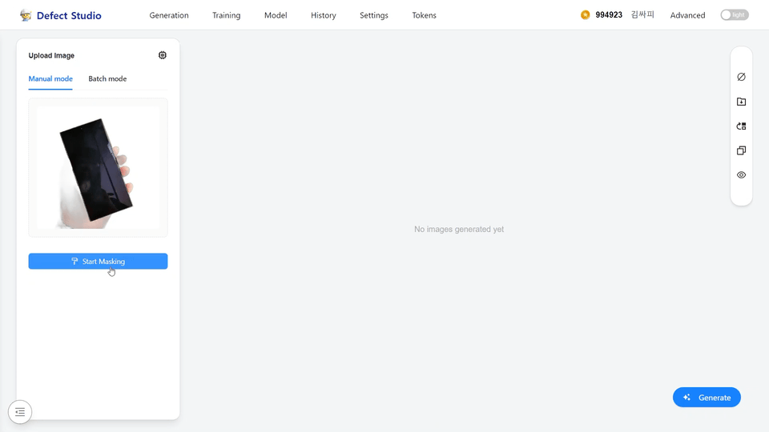

불필요한 요소들을 AI가 스스로 파악해서 없애서 이미지를 깔끔하게 만들어 줍니다!

### 📌 Remove Background

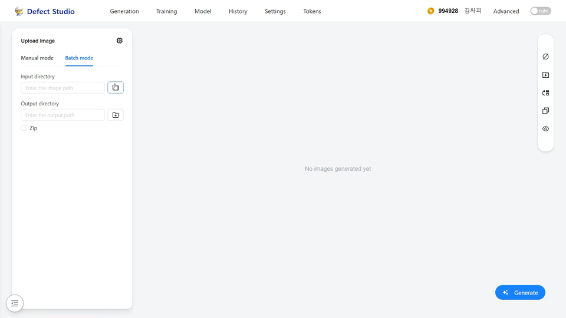

배경화면 부분을 알아서 없애 주어 손쉽게 투명 이미지를 만들 수 있습니다.

### 공통적인 요소

**Preset**

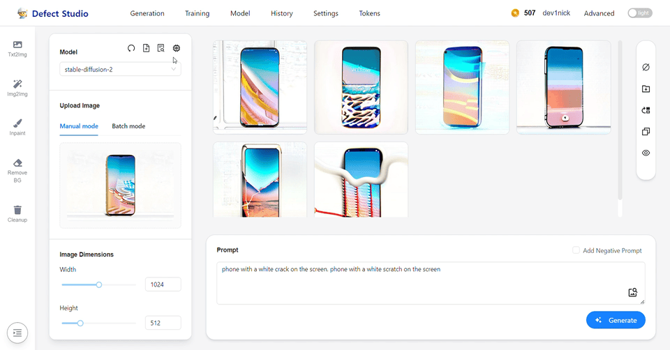

각각 파트에서 자기가 원하는 Prompt 글 및 여러가지 Parameter 설정값을 저장할 수 있습니다.  
이를 통해 쉽게 여러가지 parameter 및 프롬프트를 불러 올 수 있습니다.

**Batch Mode**

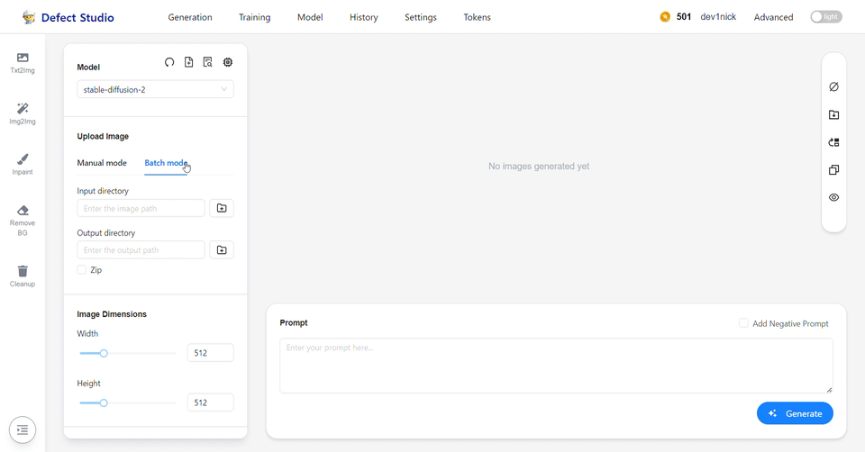

여러장의 이미지에 대해서 업로드 하지 않고, 파일 경로만 지정하면 알아서 이미지를 읽어와서  
관련된 처리를 손쉽게 할 수 있습니다!

**Side Bar**

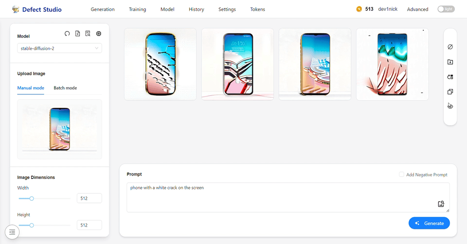

사이드를 통해서 이미지 선택, 다운로드, 작업물 삭제 등을 손쉽게 할 수 있습니다

## 🎯 Training

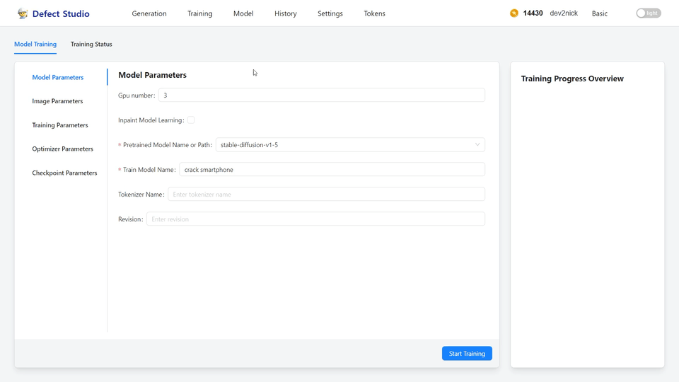

사용자가 만약 특화된 이미지에 대한 학습을 시키고 싶을 때  
해당 부분에서 다양한 파라미터 및 기본 Model 선택. 학습 이미지가 담긴 경로 선택 등을 할 수 있습니다.

학습 중에는 실시간으로 학습 상황에 대한 통계를 볼 수 있습니다.

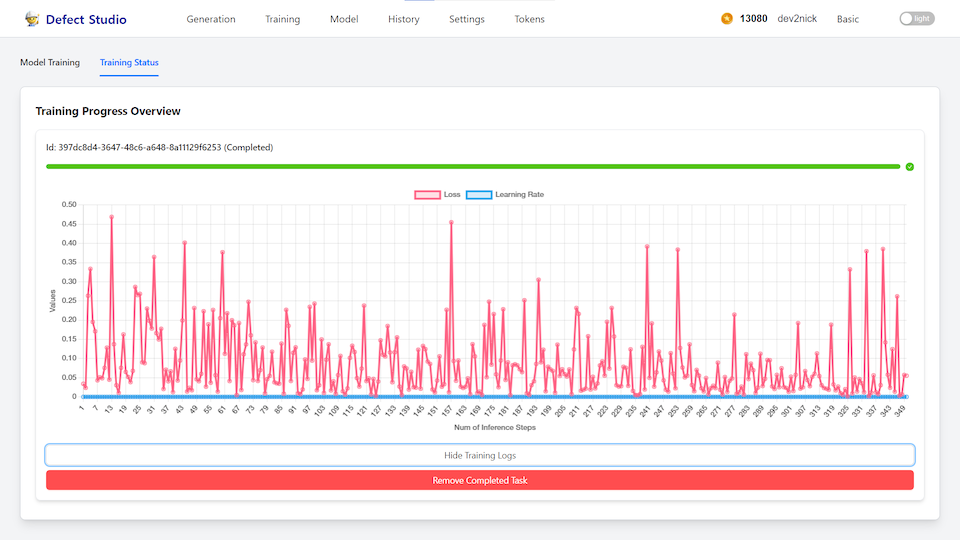

## 🎯 History

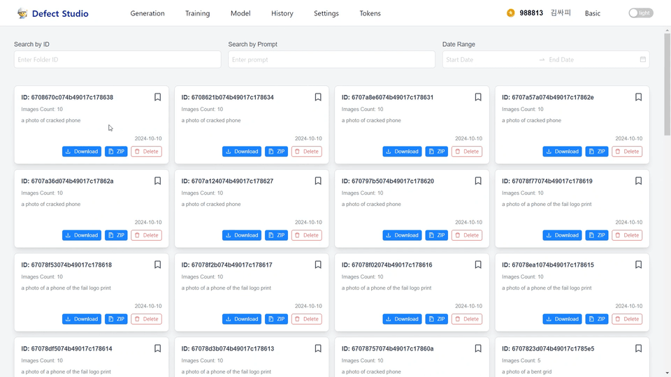

사용자들은 Generation 사용한 기록들을 볼 수 있습니다.  
해당 기록을 통해서 이전에 생성한 이미지들에 대해서 쉽게 다운로드 할 수 있으며,  
해당 기록에는 프롬프트 정보, 툴 도구,를 확인할 수 있습니다.

또한 북마크 기능을 활용하면 Home 페이지에 해당 북마크 목록을 볼 수 있도록 하였습니다.

## 🎯 Settings

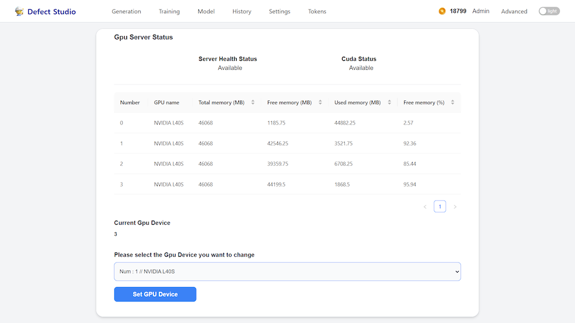

Settings에는 현재 GPU 서버 상태를 확인할 수 있고.  
기본적으로 사용할 GPU 서버를 선택할 수 있습니다.

## 🎯Token

AI 생성 및 훈련에 대해서 많은 컴퓨터 자원을 소모합니다. 따라서 사용자들이 무작정 사용하는 것을 막기 위해 **토큰** 이라는 시스템을 도입하였습니다.

### 📌 Token 발행

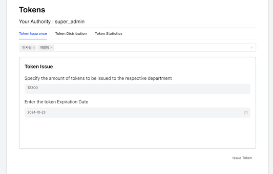

본 기능은 계정 권한 중 최상위 **super_admin** 에만 활성화 되어 있습니다.

해당 기능은 각 부서별에 토큰에 대한 발급을 담당합니다.  
해당 부분에서는 부서에 전달항 토큰 양 및 유효기간을 설정해서  
넘길 수 있습니다.

### 📌 Token 분배

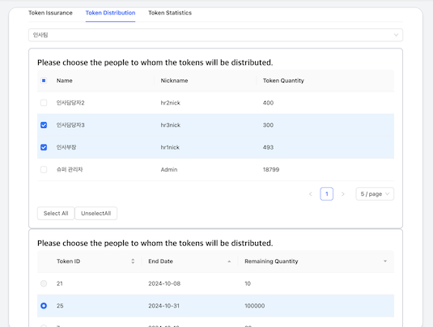

본 기능은 계정 권한 중 **super_admin** 혹은 **department_admin** 에만 활성화가 되어 있습니다.

발행을 통해 받은 토큰에 대해서 해당 부서 내에 있는 사람들 중 전달할 사람들을 선택허여  
해당 사람들에게 토큰을 넘겨 줄 수 있습니다.

### 📌 Statistics

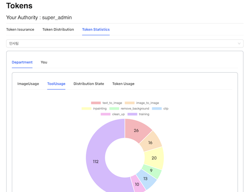

부서 (super_admin, department_admin 만 가능) 및 자기자신에 대한  
다양한 사용 통계를 알 수 있습니다.

- 모델 사용 빈도
- 토큰 사용량, 이미지 생성량
- Tool 사용 빈도 통계

## 🎯 회원

### 📌 회원가입 & 이메일 인증

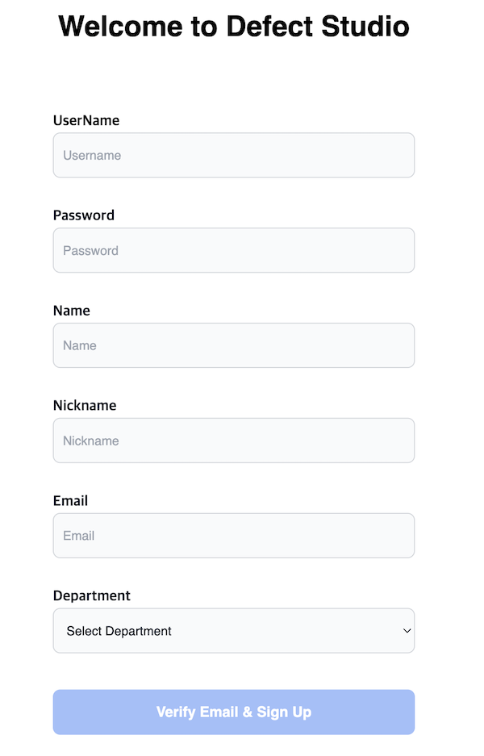

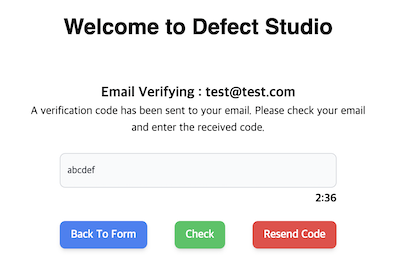

회원 가입 시 해당 이메일이 유효한 이메일인지 확인하기 위해서  
확인 코드를 요구합니다.

실제 이메일에 전송된 코드를 입력할 경우 "임시 회원" 으로서 승인이 되고  
정식으로 승인이 되기 위해서는 관리자의 [회원관리](user_management)를 통해서  
승인이 되어야 합니다.

### 📌 회원관리

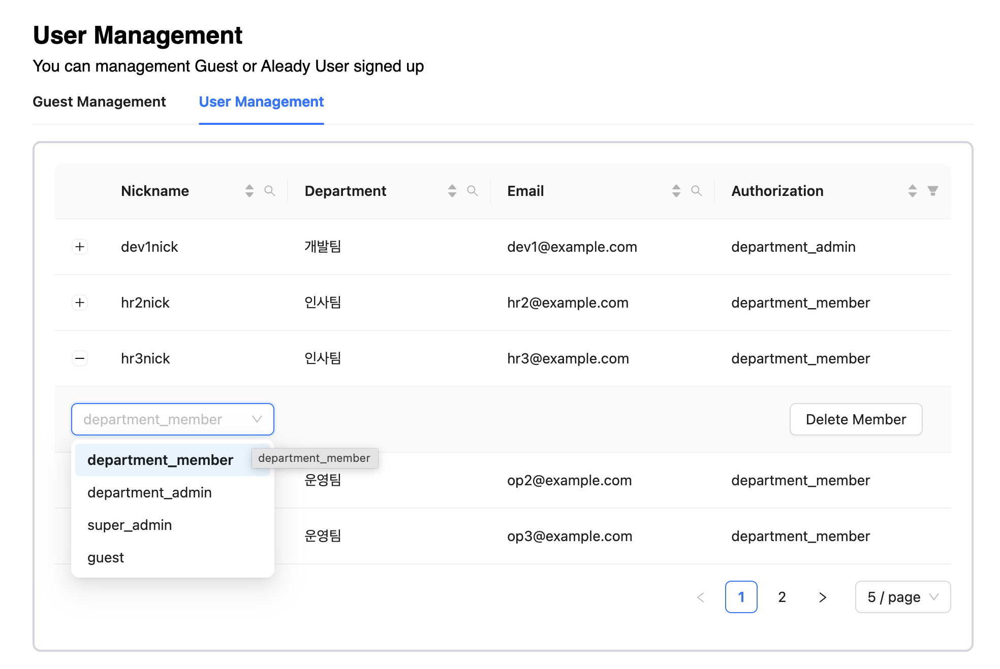

본 기능은 **super_admin** 만 가능한 기능입니다.

기존 회원들에 대한 계정 권한 정보 수정, 계정 삭제 (강제 탈퇴) 등이 가능하며,  
임시 회원에 대한 승인,거절 선택을 할 수 있습니다.

---

# 🔆 기술

## 🖥️ Front End

### Electon

Electron 이라는 프레임 워크를 이용하여서 React 환경에서도 마치 프로그램을  
개발 할 수 있었습니다.

## 🌐 Back End

### FastAPI

고성능에 중점을 두고 있는 가장 빠른 마이크로 프레임워크인 FastAPI를 활용하여
AI 주제에 적합한 BE 프레임워크 활용 역량을 쌓을 수 있었습니다.
FastAPI의 API 문서화 자동화 기능(swagger), type hint를 사용한 빠르고 안전한 validation, DI(의존성 주입) 중심 설계로 간편한 개발이라는 장점을 적극 활용했습니다.

### Redis & Celery

AI 학습 및 AI Generation 기능 사용과 같이 장시간의 작업이 필요한 기능을 처리하고 시스템 응답성을 유지하기 위해
Redis와 Celery를 이용하여 비동기 처리를 구현했습니다.
따라서 Defect Studio에서 AI 모델 학습 중에도 다른 작업들을 처리할 수 있습니다.

## 🎓 AI

## 💻 Infra

---

# 기대효과
